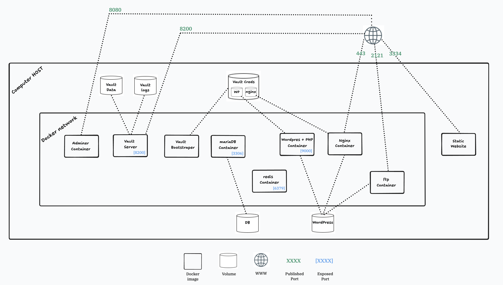

# Inception - Docker Infrastructure Project



## Overview

42 School Inception: A comprehensive Docker infrastructure featuring web server (NGINX with TLS), WordPress CMS, MariaDB database, Redis cache, FTP server, Adminer, and HashiCorp Vault for centralized secrets management. Implements Infrastructure as Code with custom Dockerfiles and automated deployment.

## Architecture

The project consists of multiple containerized services orchestrated through Docker Compose:

- **NGINX**: Reverse proxy with TLS/SSL encryption (ports 443, 3834)
- **WordPress + PHP-FPM**: Content management system (port 9000)
- **MariaDB**: Relational database backend (port 3306)
- **Redis**: Caching layer for performance optimization (port 6379)
- **FTP Server**: File transfer service (port 21)
- **Adminer**: Database management interface
- **HashiCorp Vault**: Centralized secrets management (port 8200)
- **Static Website**: Project documentation (port 8080)

All services communicate through an isolated Docker network with persistent storage volumes.

## Prerequisites

- Docker
- Docker Compose
- Make
- Linux/Unix environment

## Installation & Usage

### 1. Configure Environment Variables

Navigate to the `secrets` folder and create your `.env` file based on the provided sample:
```bash
cd secrets
cp .env.sample .env
# Edit .env with your configuration
nano .env
```

### 2. Deploy the Infrastructure

From the project root directory, run:
```bash
make
```

This command will:
- Create persistent data directories at `/home/$USER/data/`
- Build all Docker images from custom Dockerfiles
- Start all containers with proper networking and volume mounts

**Note**: The data folder (`/home/$USER/data/`) contains persistent storage for all services. Some files will be owned by root due to UID mapping between containers and the host system.

### 3. Access the Services

#### WordPress Website
- **URL**: `https://localhost:443` or `https://ymafaman.42.fr` (if configured in `/etc/hosts`)
- Access the WordPress admin panel and start creating content

#### HashiCorp Vault
- **URL**: `http://localhost:8200`
- **Credentials**: Use the `userpass` authentication method
- Manage secrets, certificates, and database credentials

#### Adminer (Database Management)
- Access through the configured port to manage MariaDB

#### FTP Server
- Connect using your configured FTP credentials for file management

### 4. Managing the Infrastructure

#### Stop Services
```bash
make down
```

#### Complete Cleanup (removes containers, volumes, and images)
```bash
make full-down
```

#### Remove Data Directories
```bash
make rm-data
```
**Note**: This requires `sudo` privileges as some files are owned by root.

#### Full Cleanup and Rebuild
```bash
make re
```

## Project Structure
```
./
├── README.md
├── infrastructure-diagram.png
├── secrets/
│   ├── .env.sample
├── srcs/
│   ├── Makefile
│   ├── docker-compose.yml
│   └── requirements/
│       ├── bonus/
│       │   ├── Static Website/
│       │   │   ├── Dockerfile
│       │   │   └── html/
│       │   │       └── index.html
│       │   ├── Vault/
│       │   │   ├── Dockerfile
│       │   │   └── Configs/
│       │   │       └── server-config.hcl
│       │   ├── Vault-Bootstraper/
│       │   │   ├── Dockerfile
│       │   │   ├── policies/
│       │   │   │   ├── password-policy.hcl
│       │   │   │   ├── ssl_cert_policy.hcl
│       │   │   │   └── wp-db-policy.hcl
│       │   │   └── tools/
│       │   │       └── init-vault.sh
│       │   ├── adminer/
│       │   │   └── dockerfile
│       │   ├── ftp/
│       │   │   ├── Dockerfile
│       │   │   ├── conf/
│       │   │   │   ├── conf2.conf
│       │   │   │   └── vsftpd.conf
│       │   │   └── tools/
│       │   │       └── init.sh
│       │   └── redis/
│       │       ├── dockerfile
│       │       └── config/
│       │           └── redis.conf
│       ├── mariadb/
│       │   ├── Dockerfile
│       │   ├── conf/
│       │   │   └── mariadb-server.cnf
│       │   └── tools/
│       │       └── init-db.sh
│       ├── nginx/
│       │   ├── Dockerfile
│       │   ├── conf/
│       │   │   └── ymafaman.conf
│       │   └── tools/
│       │       └── init-nginx.sh
│       └── wordpress/
│           ├── Dockerfile
│           └── tools/
│               └── configure-wp.sh
```

## Security Features

- **TLS/SSL Encryption**: NGINX configured with TLSv1.2/TLSv1.3
- **Vault Integration**: 
  - AppRole authentication for services
  - Dynamic TLS certificate generation with Vault-managed CA
  - Short-lived database credentials with instant revocation
  - Runtime secret injection (never stored in images)
  - Emergency sealing capability for security incidents
- **Isolated Network**: All services communicate through a dedicated Docker network
- **Minimal Attack Surface**: Each container runs a single process

## Technical Implementation

- All Docker images built from scratch using Alpine/Debian base images
- Infrastructure as Code approach with version-controlled configurations
- Single process per container (PID 1) following Docker best practices
- Automated deployment with Makefile orchestration
- Persistent volumes for data durability

## Troubleshooting

### Permission Issues with Data Folders
If you encounter permission issues when removing data folders, use:
```bash
sudo make rm-data
```

### Container Won't Start
Check logs for specific service:
```bash
docker compose logs 
```

### Vault Sealed
If Vault is sealed after restart, unseal it using your unseal keys (stored at `/home/$USER/data/vault-creds/`) through the web UI or CLI.

## License

This project is part of the 42 School curriculum.

## Links

- [42 Network](https://www.42network.org/)
- [1337 School](https://1337.ma/)